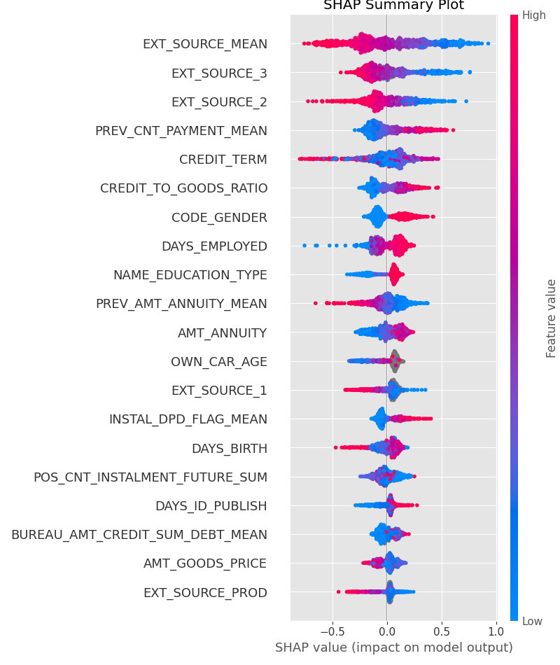

# Credit Scoring - Prédiction de Défaut de Paiement

Pipeline complet de machine learning pour la prédiction du risque de défaut de crédit, basé sur les données du challenge [Home Credit Default Risk](https://www.kaggle.com/c/home-credit-default-risk).

L'objectif principal n'était pas de maximiser l'AUC comme dans les compétitions Kaggle classiques, mais d'**optimiser directement le Coût Métier**. Cette approche reflète la réalité économique : un défaut non détecté (Faux Négatif) coûte bien plus cher qu'un refus abusif (Faux Positif).

**[👉 Tester l'application](https://credit-scoring-analysis-pipeline.streamlit.app/)**


## Coût Métier : L'Indicateur Clé

La fonction objectif a été paramétrée pour refléter l'asymétrie des risques :

| Type d'Erreur | Coût | Explication |
|---------------|------|-------------|
| **Faux Négatif** (défaut non détecté) | **10** | Perte du capital prêté |
| **Faux Positif** (refus abusif) | **1** | Opportunité commerciale perdue |

Cette pondération 10:1 pousse le modèle vers un **recall élevé** (détection maximale des défauts) tout en contrôlant les refus abusifs.


## Contexte et Données

Le dataset Home Credit comprend **10 fichiers distincts** totalisant plus de 30 millions de lignes :

| Fichier | Description | Volume |
|---------|-------------|--------|
| `application_train.csv` | Données principales des demandeurs | 307k |
| `application_test.csv` | Données de test | 48k |
| `bureau.csv` | Historique de crédit (autres institutions) | 1.7M |
| `bureau_balance.csv` | Soldes mensuels bureau | 27M |
| `previous_application.csv` | Demandes précédentes Home Credit | 1.6M |
| `POS_CASH_balance.csv` | Soldes crédits POS | 10M |
| `credit_card_balance.csv` | Soldes cartes de crédit | 3.8M |
| `installments_payments.csv` | Historique de paiements | 13.6M |
| `HomeCredit_columns_description.csv` | Dictionnaire des variables | - |
| `sample_submission.csv` | Format de soumission | - |

La difficulté principale réside dans l'**agrégation intelligente** de ces sources pour créer des features pertinentes au niveau client.

## Feature Engineering

Deux versions du dataset ont été créées :
- **V1** : Conservation de toutes les colonnes, y compris celles avec >50% de valeurs manquantes
- **V2** : Suppression des colonnes inutiles ou trop vides (habitat, documents)

### Ratios Financiers
```python
CREDIT_INCOME_PERCENT = AMT_CREDIT / AMT_INCOME_TOTAL
ANNUITY_INCOME_PERCENT = AMT_ANNUITY / AMT_INCOME_TOTAL
CREDIT_TO_GOODS_RATIO = AMT_CREDIT / AMT_GOODS_PRICE
```

### Agrégations des Tables Externes
- **Bureau** : Nombre de crédits actifs, montant total dû, retards moyens
- **Previous Applications** : Taux d'acceptation, montants moyens demandés
- **Installments** : Retards de paiement, écarts entre dû et payé
- **POS/Cash** : Nombre de mensualités restantes, statut des crédits

### Encodage
- **One-Hot Encoding** pour les variables nominales
- **Label Encoding** pour les variables ordinales

Le résultat : passage de ~120 features brutes à **180+ features enrichies**.

## Modélisation

### Benchmark des Modèles

L'entraînement initial a identifié **LightGBM** comme l'algorithme le plus performant :

| Modèle | AUC | Coût Métier |
|--------|-----|-------------|
| Dummy | 0.50 | 35 000 |
| Random Forest | 0.73 | 23 000 |
| XGBoost | 0.76 | 22 500 |
| **LightGBM** | **0.788** | **21 200** |

Les performances étaient similaires entre V1 et V2, la V2 a été retenue pour sa légèreté.

### Optimisation Optuna

L'optimisation des hyperparamètres via **Optuna** a ciblé uniquement la minimisation du Coût Métier sur l'ensemble de validation, garantissant que le modèle converge vers la solution la plus rentable économiquement.

Une approche par Validation Croisée (5 folds) avait été envisagée mais s'est avérée moins performante que le modèle LightGBM unique optimisé.

## Explicabilité SHAP

L'analyse SHAP assure la transparence requise pour un outil de credit scoring :



**Variables déterminantes :**
- **Scores Externes (EXT_SOURCE_X)** : Variables les plus importantes, provenant de sources externes. Un score faible augmente significativement la probabilité de défaut.
- **Âge du Client (DAYS_BIRTH)** : Les clients plus jeunes sont associés à un risque accru.
- **Montant de l'Annuité (AMT_ANNUITY)** : Indicateur de la charge de remboursement mensuelle.

Ces variables confirment que le modèle prend ses décisions selon des indicateurs de risque classiques, tout en optimisant le rendement financier via le Coût Métier.

## Dashboard Interactif

Le dashboard Streamlit permet deux usages :

### Audit Client
Sélection d'un client existant pour vérifier la cohérence du modèle avec l'historique réel.


### Simulateur de Crédit
Simulation d'une nouvelle demande avec des paramètres ajustables :
- Revenu annuel, montant du crédit, prix du bien
- Âge et ancienneté d'emploi
- Durée du prêt

Le modèle retourne une probabilité de défaut et un niveau de risque.


## Structure du Projet

```
├── main.py                      # Pipeline complet (CLI)
├── app_dashboard.py             # Dashboard Streamlit
├── api_server.py                # API Flask pour le modèle
├── docker-compose.yml           # Orchestration des services
│
├── src/
│   ├── config.py                # Paramètres (coûts métier, chemins)
│   ├── data_prep.py             # Feature engineering
│   ├── model_utils.py           # Entraînement et optimisation
│   ├── metrics.py               # Coût métier et métriques
│   └── explainability.py        # SHAP
│
├── notebooks/
│   ├── 01_v2_data_preparation   # Exploration et feature engineering
│   ├── 02_model_training        # Benchmark et optimisation
│   ├── 03_explainability        # Analyse SHAP
│   └── 04_mlflow_serving_test   # Test de l'API
│
├── tests/                       # Tests unitaires (pytest)
├── models/                      # Modèles entraînés (.pkl)
├── reports/figures/             # Graphiques SHAP
└── dashboard_data/              # Données pour le dashboard
```

## Installation et Exécution

### Option 1 : Dashboard en ligne (Aucune installation)

**[👉 Accéder au Dashboard](https://credit-scoring-analysis-pipeline.streamlit.app/)**

---

### Option 2 : Docker (Développement local)

```bash
# Cloner le projet
git clone https://github.com/Gael926/credit-scoring-analysis-pipeline.git
cd credit-scoring-analysis-pipeline

# Lancer les services
docker compose up --build
```

| Service | URL |
|---------|-----|
| Dashboard | http://localhost:8501 |
| API Modèle | http://localhost:5001 |
| Jupyter | http://localhost:8888 |

---

### Option 3 : Ré-entraîner le modèle

```bash
pip install -r requirements.txt

# Télécharger les données Kaggle dans data/raw/
# https://www.kaggle.com/c/home-credit-default-risk/data

python main.py --n-trials 50
```


## Technologies

- **ML** : LightGBM, Optuna, SHAP
- **Data** : Pandas, NumPy
- **Web** : Streamlit, Flask
- **MLOps** : MLflow, Docker
- **Tests** : Pytest

## Résultats

| Métrique | Valeur |
|----------|--------|
| AUC ROC | 0.788 |
| Coût Métier | 21 200 (vs 35 000 baseline) |
| Amélioration | **~40%** de réduction du coût |

Le modèle privilégie la détection des défauts (faux négatifs coûteux) tout en maintenant un taux de faux positifs acceptable. La traçabilité complète est assurée par MLflow.