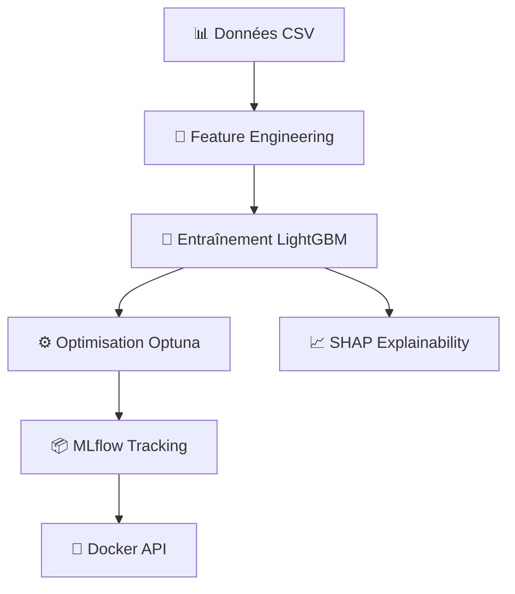

# Credit Scoring Model

Ce projet implémente un pipeline complet de Credit Scoring, de la préparation des données au déploiement du modèle, en passant par l'entraînement, l'optimisation et l'explicabilité (SHAP).

## Architecture du Pipeline




## Structure du Projet

- `data/` : Données brutes et procesées.
- `notebooks/` :
  - `01_v2_data_preparation.ipynb` : Préparation des données (Feature Engineering).
  - `02_model_training.ipynb` : Entraînement, Optimisation (Optuna) et Tracking (MLflow).
  - `03_explainability.ipynb` : Analyse SHAP (Globale et Locale).
  - `04_mlflow_serving_test.ipynb` : Test de l'API de prédiction.
- `src/` : Code modulaire (`model_utils.py`, `explainability.py`, etc.).
- `models/` : Artefacts des modèles entraînés.
- `mlruns/` : Tracking MLflow local.
- `reports/` : Figures et analyses.

## Prérequis
- Python 3.11
- Docker Desktop (installé et lancé) : [Télécharger Docker Desktop](https://www.docker.com/products/docker-desktop/)

## Installation

1. Cloner le projet.
2. Installer les dépendances :
```bash
pip install -r requirements.txt
```
3. Lancer MLflow UI (optionnel pour visualiser les runs) :
```bash
mlflow ui
```

## Étapes d'Exécution

### 1. Entraînement
Ouvrir et exécuter `notebooks/01_v1_data_preparation.ipynb`.
Ouvrir et exécuter `notebooks/01_v2_data_preparation.ipynb`.
- Préparation des données (Feature Engineering).
- 2 versions de la préparation des données différentes.

Ouvrir et exécuter `notebooks/02_model_training.ipynb`.
- Entraîne plusieurs modèles (Dummy, Random Forest, XGBoost, LightGBM).
- Régression logistique via imputation.
- Optimise LightGBM avec Optuna.
- Sauvegarde le meilleur modèle dans `models/best_model.pkl` et `models/final_model` (format MLflow).

### 2. Explicabilité
Ouvrir et exécuter `notebooks/03_explainability.ipynb`.
- Génère les graphiques SHAP (Global Feature Importance, Beeswarm).
- Génère des explications locales pour des clients spécifiques.
- Les figures sont sauvegardées dans `reports/figures`.

### 3. Déploiement (Docker)
Le projet utilise Docker Compose pour lancer simultanément :
1. **L'API de prédiction (MLflow)** sur le port `5000`.
2. **Un serveur Jupyter Notebook** sur le port `8888`.

**Lancer les services :**
```bash
docker compose up --build
```
*Note : Assurez-vous que Docker Desktop est lancé.*

- Accès API : `http://localhost:5000`
- Accès Jupyter : `http://localhost:8888` (le token est désactivé)

Pour arrêter les services, faites `Ctrl+C` dans le terminal.

### 4. Test API
Ouvrir `notebooks/04_mlflow_serving_test.ipynb` pour envoyer des requêtes au conteneur Docker et obtenir des prédictions.