# Credit Scoring Model

Ce projet implémente un pipeline complet de Credit Scoring, de la préparation des données au déploiement du modèle, en passant par l'entraînement, l'optimisation et l'explicabilité (SHAP).

## Architecture

```mermaid
flowchart TD
    A[📊 Données CSV] --> B[🔧 Feature Engineering]
    B --> C[🎯 Entraînement LightGBM]
    C --> D[⚙️ Optimisation Optuna]
    D --> E[📦 MLflow Tracking]
    E --> F[🚀 API MLflow]
    F --> G[🖥️ Dashboard Streamlit]
    C --> H[📈 SHAP Explainability]
```



[](https://github.com/Gael926/credit-scoring/actions/workflows/ci.yml)

## Structure du Projet

```
├── app_dashboard.py          # Dashboard Streamlit
├── main.py                   # Pipeline complet
├── docker-compose.yml        # Services Docker
├── src/                      # Code modulaire
├── scripts/                  # Scripts utilitaires
├── notebooks/                # Exploration et tests
├── models/                   # Modèles entraînés
├── dashboard_data/           # Données pour le dashboard
└── reports/figures/          # Graphiques SHAP
```

## Prérequis

- Python 3.11
- Docker Desktop : [Télécharger](https://www.docker.com/products/docker-desktop/)

## Installation

```bash
pip install -r requirements.txt
```

## Exécution

### Option 1: Pipeline complet
```bash
python main.py --n-trials 10
```

Options : `--skip-training`, `--skip-shap`, `--n-trials N`

### Option 2: Docker (Production)

**1. Générer les données du dashboard :**
```bash
python scripts/generate_dashboard_data.py
```

**2. Lancer les services :**
```bash
docker compose up --build
```

**Services disponibles :**
| Service | URL | Description |
|---------|-----|-------------|
| Dashboard | `http://localhost:8501` | Interface utilisateur Streamlit |
| API MLflow | `http://localhost:5000` | API de prédiction |
| Jupyter | `http://localhost:8888` | Notebooks |

### Option 3: Notebooks (Exploration)

- `01_v2_data_preparation.ipynb` : Feature Engineering
- `02_model_training.ipynb` : Entraînement et Optimisation
- `03_explainability.ipynb` : Analyse SHAP
- `04_mlflow_serving_test.ipynb` : Test de l'API